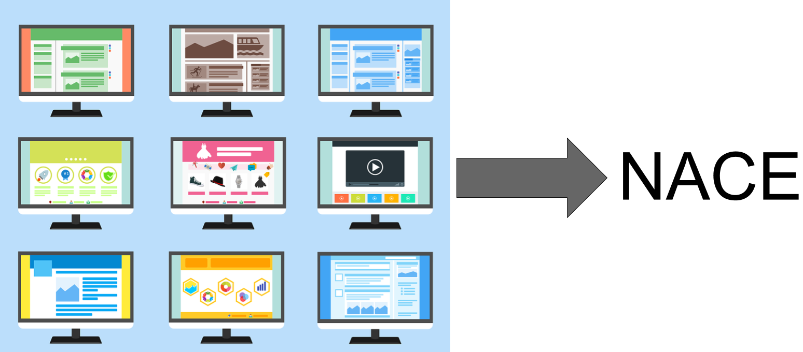
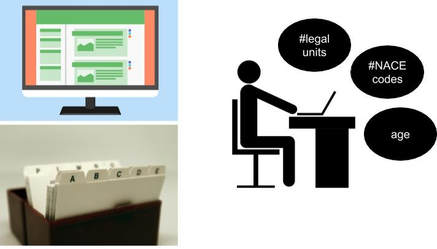

```{r setup, include=FALSE}
require(DT)
require(readxl)
require(ggplot2)
require(plotly)
```


##Introduction


```{r, echo=FALSE}
df <- read_excel("C:/git_repositories/seminarGITHUB/table_bank.xlsx")

df$sector <- sort(df$sector)

p <- ggplot(df, aes(x = sector, y = number)) +
  geom_bar(stat="identity", fill="steelblue")+
  theme_minimal() +
  ylab("Number of bankruptcies of businesses and institutions") +
  xlab("")

p <- p + coord_flip()

ggplotly(p)
```

## NACE codes

Classify economic activities: NACE

*"Nomenclature statistique des Activités économiques dans la Communauté Européenne"*


The NACE is a hierarchical classification and contains four-digit codes

## NACE codes


General Business Register (GBR)

47.2.4 - Retail sale of bread, cakes, flour confectionery

96.0.2 - Hairdressing 

## NACE codes

- Incorrect code appointed during registration
- Structure of an enterprise changes over time
- Changes in the activity of an interprise

## NACE codes


Manual checks are costly and time-consuming...

## Previous research

<center>

</center>

# Current research

## So we decided to turn things around...
<center>

</center>

## Current research

<center>

</center>

## Current research

<center>

</center>

## Current research

<center>

</center>

## Current research  {.columns-2}

<center>

</center>

  1. Predicted label
  2. Observed label
  3. Agreement
  4. Probability of an error based on enterprise characteristics


## Testing the method: experiments {.columns-2}
<center>

</center>

- Percentage of errors
- Subtle / obvious errors
- Size of the labeled set
- Relating enterprise characteristics to probability of an error

## Results...

## Questions?